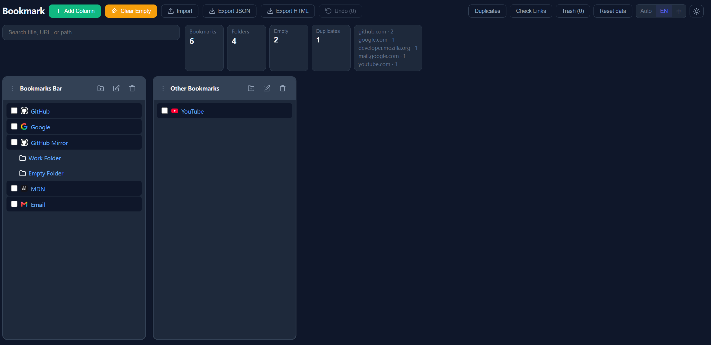

<p align="center">
  
</p>

<div align="center">

[English](README.md) · [简体中文](README.zh.md)

</div>

# Bookmark-Extension

> A Chrome / Edge bookmark manager extension — multi-column browsing, drag & drop organization, search, import/export, and trash backup.

Built on Manifest V3, it reads and writes the browser's native bookmark tree directly, providing more powerful organization than the browser's built-in bookmark manager.

## Features

### Browse & Navigate

- Multi-column bookmark folders, with add / remove column support
- Adjustable column widths and draggable column order
- Bookmark detail sidebar showing path, URL, added time, and URL copy support



### Organize


- Drag & drop bookmarks, with drop-to-position sorting
- Batch selection, batch move, and batch delete
- Move undo stack, supporting undo of single or batch moves
- Edit bookmark titles and URLs, rename folders
- Clean up empty folders with a safe "check to delete" flow
- Root folder protection (Bookmarks bar / Other bookmarks cannot be deleted)

### Search

- Global search across titles, URLs, and paths, with locate-to-folder support

### Check

- Duplicate bookmark scanning, grouped by normalized URL
- Manual link check for up to 50 targets, distinguishing valid, invalid, and unknown

### Data

- JSON and Netscape HTML bookmark import / export
- Trash backup — recoverable copies are kept before deletion
- First-run onboarding (shown when bookmarks are empty; supports importing a file or loading sample data)

### Customization

- Theme switching (light / dark)
- Chinese & English UI

## Tech Stack

| Category   | Technology                   |
| ---------- | ---------------------------- |
| Framework  | React 18 + TypeScript 5      |
| Build      | Vite 5                       |
| Extension  | Chrome Extension Manifest V3 |
| Testing    | Vitest 4                     |
| Code style | ESLint 10                    |

## Development

```powershell
npm install
npm run dev
```

## Build the Extension

```powershell
npm run build
```

## Verification Commands

```powershell
npm run typecheck   # Type checking
npm run lint        # Lint
npm test            # Unit tests
npm run build       # Full build (including postbuild)
```

## Project Structure

```
Bookmark/
├── src/
│   ├── components/         # React components (TreeView, Modals, WelcomeScreen, etc.)
│   ├── context/            # I18n and theme contexts
│   ├── i18n/               # Chinese & English translations
│   ├── lib/                # Core logic: bookmarks, storage, import/export, cleanup
│   ├── styles/             # CSS (app.css, themes.css)
│   ├── types/              # TypeScript type definitions
│   ├── App.tsx             # Main app
│   ├── main.tsx            # Entry point
│   ├── styles.css          # Global styles
│   └── background.js       # Extension service worker
├── public/icons/           # Extension icons (16 / 32 / 48 / 128)
├── scripts/copy-assets.cjs # Post-build script
├── manifest.json           # MV3 manifest
├── vite.config.ts
└── tsconfig.json
```

## Permissions

| Permission   | Purpose                                          |
| ------------ | ------------------------------------------------ |
| `bookmarks` | Read, create, move, update, and delete bookmarks |
| `storage`   | Save theme, language, column layout, trash metadata |

Link checking is triggered manually and handles cross-origin restrictions conservatively. Since host permissions for all sites are not requested, some links may show as "unknown", which does not necessarily mean they are broken.

## Import/Export Formats

| Format | Description                                        |
| ------ | -------------------------------------------------- |
| JSON   | Best for backup and restore with this extension    |
| HTML   | Compatible with the common Netscape Bookmark File format |

Imported content is placed in an "Imported Bookmarks" folder to avoid duplicating the current browser bookmark tree.

## Known Limitations

- Broken-link checks are affected by CORS, site policies, and network environment; "unknown" results need manual confirmation
- Trash restore tries to restore to the original parent folder; restore may fail if the parent folder no longer exists
- Large bookmark libraries are optimized with filtering, derived-data memoization, limited search results, and reduced full re-renders; no third-party virtual scrolling library is used yet

## Related Projects

- [Bookmark-Web](https://github.com/HIUEETR/Bookmark-Web): the pure web version of this extension, deployed to GitHub Pages, using `localStorage` for bookmark data, no extension installation required

## License

Apache-2.0 license